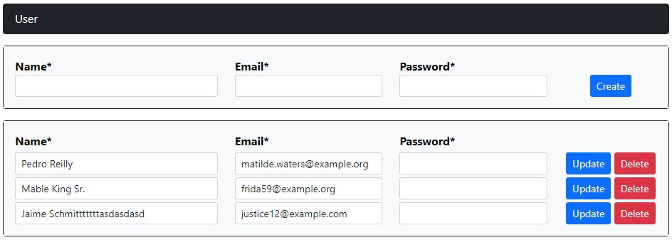
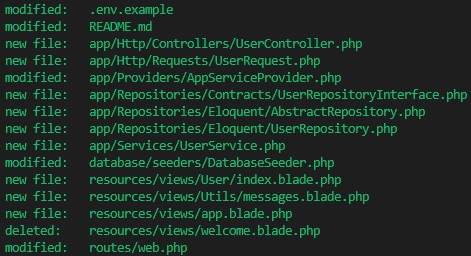

<p align="center">
    <a href="https://laravel.com" target="_blank"></a>
</p>

<h1 align="center">
    LARAVEL DDD
</h1>
<p align="center">
    Domain Driven Design - Projeto Exemplo
    <br />
</p>

<p align="center">


</p>

## 🚴 Sobre o Projeto

Projeto de estudo. Caso deseje visualizar todos os arquivos criados ou modificados para chegar ao resultado final, acesse o segundo commit nomeado: DDD

## ⚡ Requisitos e Instalação
```
PHP 8.0+
```

- Faça uma cópia do projeto e acesse a pasta
```
git clone https://github.com/gonribeiro/Laravel-DDD

cd Laravel-DDD
```
- Faça uma cópia do arquivo ```.env.example``` renomeando para ```.env```
- Instale o projeto
```
composer install
```
- Crie as tabelas do banco de dados e semeie (o projeto usa sqlite para banco de dados)
```
# caso solicite alguma confirmação, informe sim
php artisan migrate

php artisan db:seed
```
- Inicie o projeto
```
php artisan serve
```

- O projeto ficará disponível pelo endereço: http://localhost:8000/

<p align="center">
    <br />
    
    <br />
    <br />
    
</p>